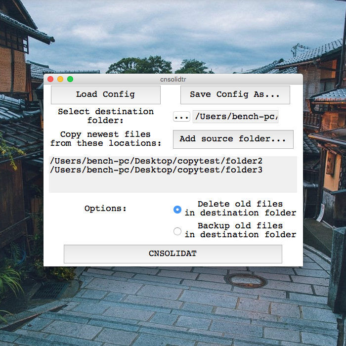

# cnsolidatr

*Efficiently create reusable templates for repetitive tasks involving copying and bringing together files from multiple sources that meet user-defined parameters. Ideal for professionals in creative fields that involve keeping a folder intended for a client up-to-date with the latest versions of rendered files.*

This was a little tool mostly for my personal use. When I would mix or master an album, I often had to consolidate mixdowns from many project files for clients and sometimes I would forget to update the client folders to the latest mixes, which this tool was meant to help solve. I do things differently when I mix albums now so it's not really needed for me anymore.

[Source code on Github](https://github.com/plungepool/cnsolidatr)