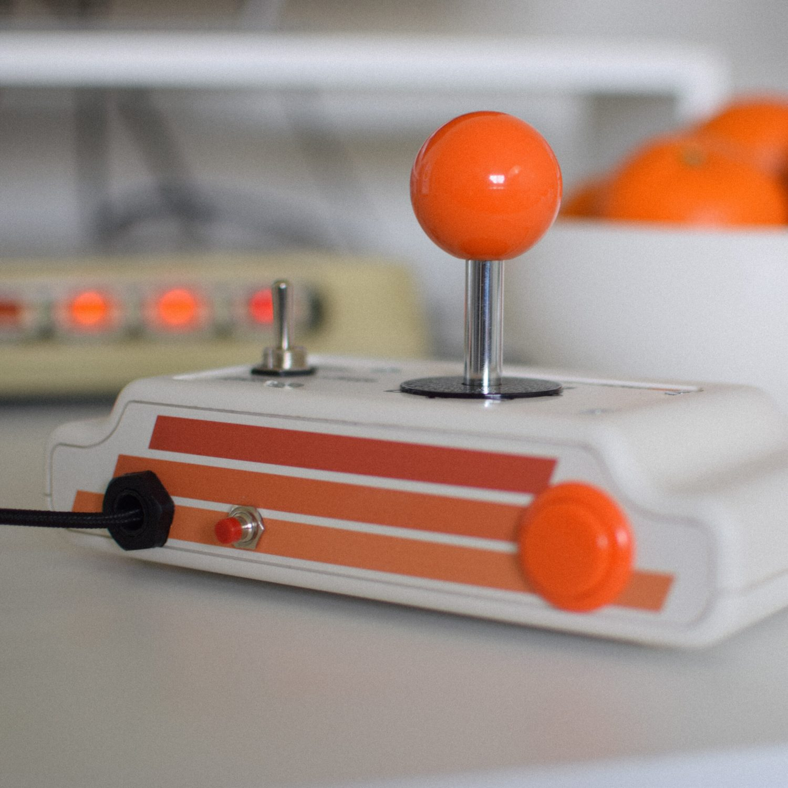
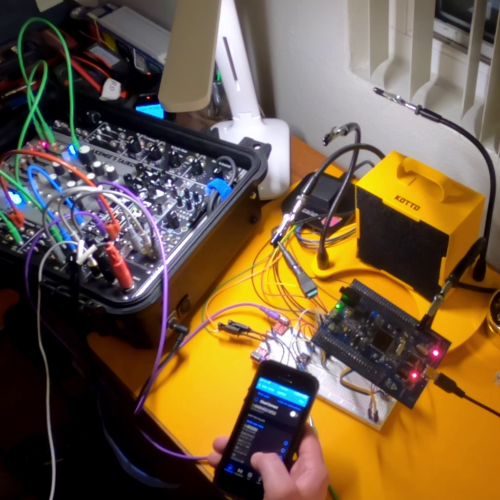
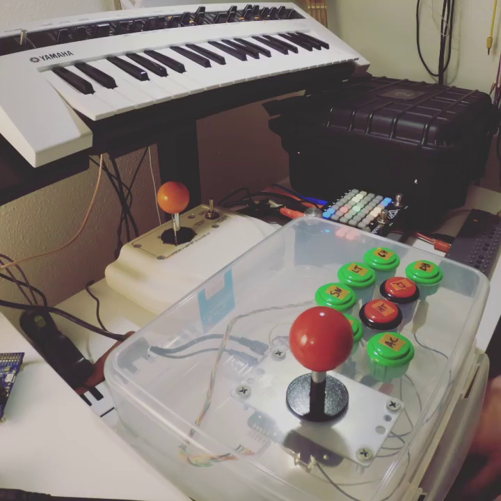

## stuff for your hands.

```
A good instrument sparks inspiration every time you touch it. I strive to coax that inspiration into unique new forms through tactile, intuitive, and practical designs.
```

| <div style="width:145px"></div>                              | <div style="width:0px"></div>                                |
| ------------------------------------------------------------ | ------------------------------------------------------------ |
|  | **MIDICHAMP DRUMSTIK 3D**<br />*The MIDIchamp DrumStik 3D is a USB MIDI instrument. It uses a professional-grade Sanwa JLF arcade stick as a performance, writing, and inspirational tool for MIDI-based music.*<br />[Learn more.](ds3d.md) |
| **CEEVOLT**<br />*CeeVolt is your personal, portable bridge between digital flexibility and analog richness. Pair with your iOS device and unlock a world of midi controllers and sequencers, now available for use with your Eurorack modular system.*<br />[Learn more.](ceevolt.md) |  |
|  | **NITEVIPR MACH2**<br />*From the next evolution in joystick-based rhythm sequencing technology comes the NiteVipr Mach2, a self-contained sample-based drum machine based around the ultra-accessible and fast live pattern performance scheme first pioneered with the MIDIchamp DrumStik 3D.*<br />[Learn more.](nitevipr.md) |

