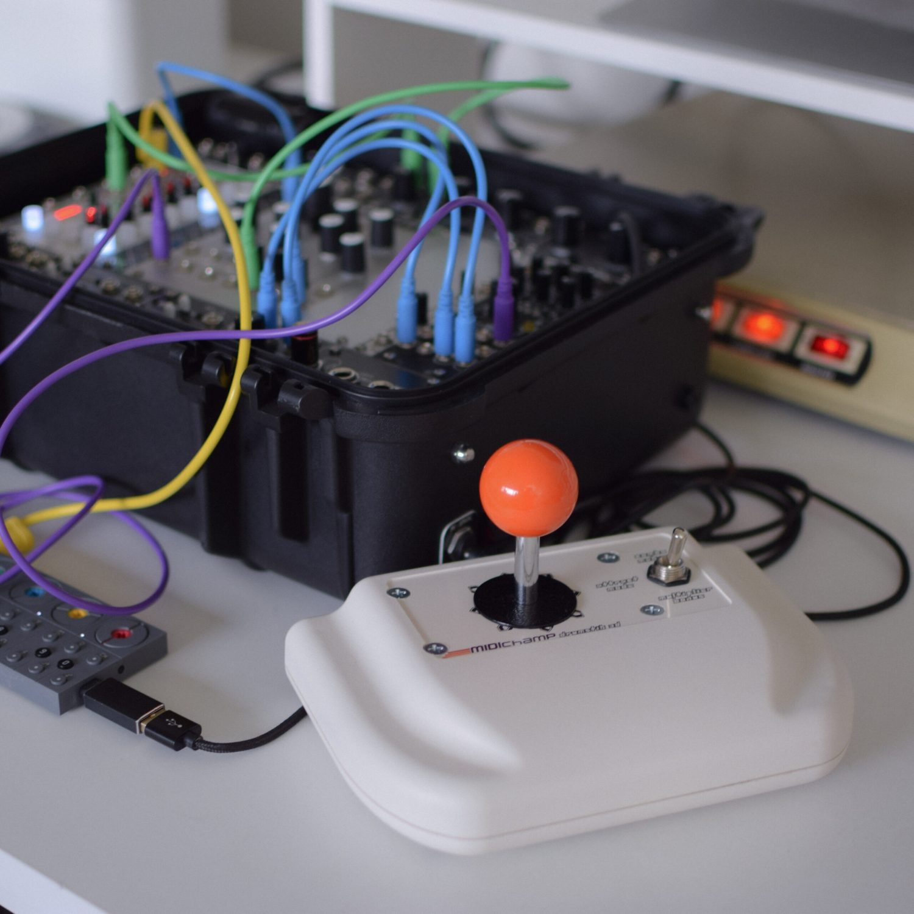
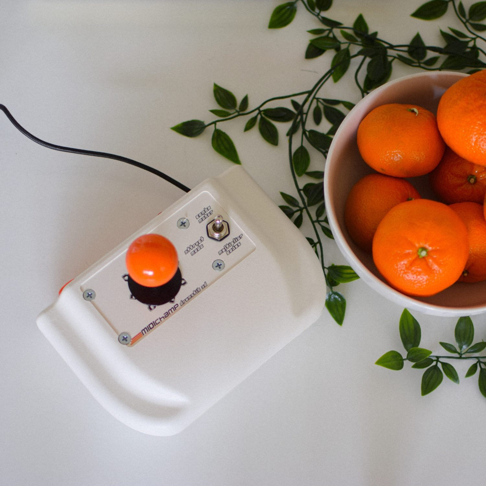
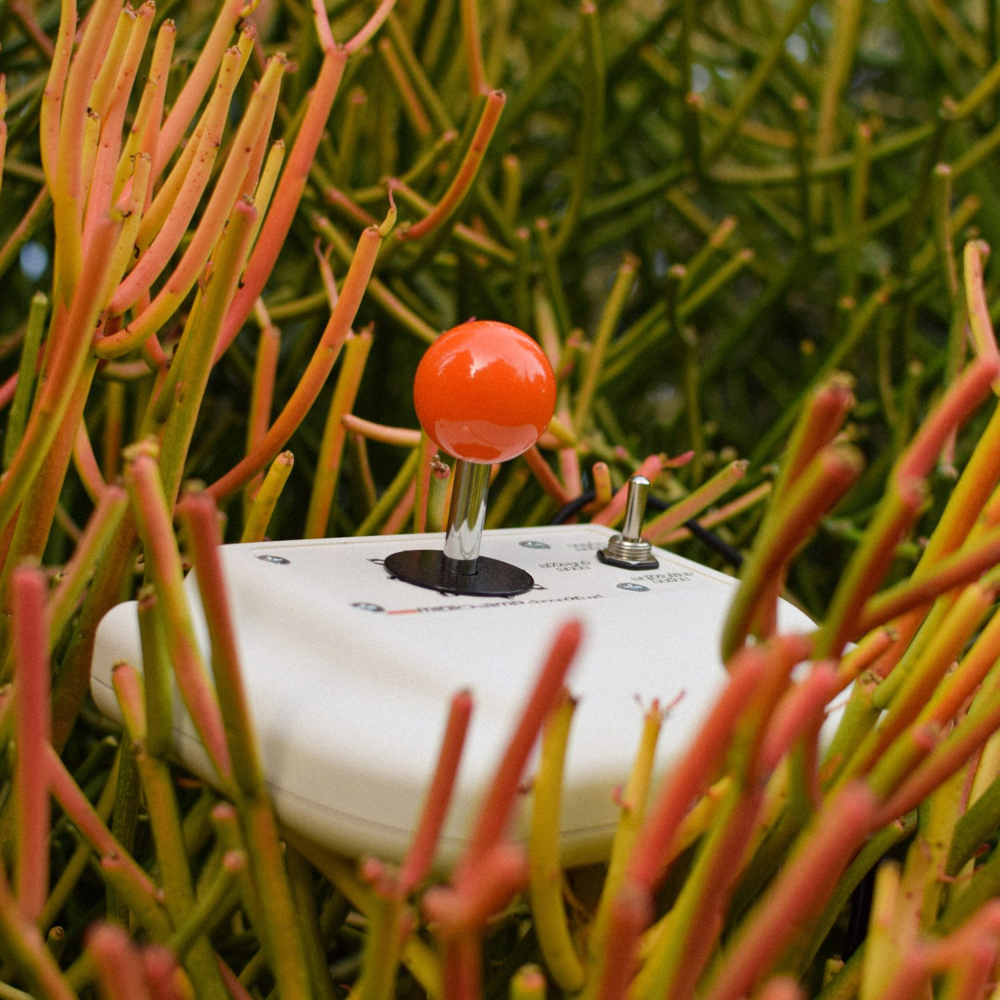
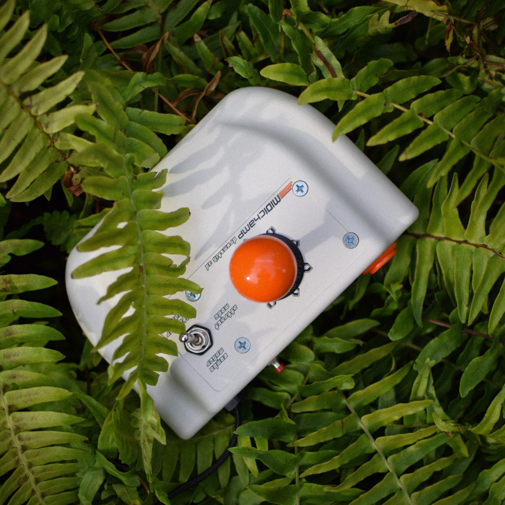
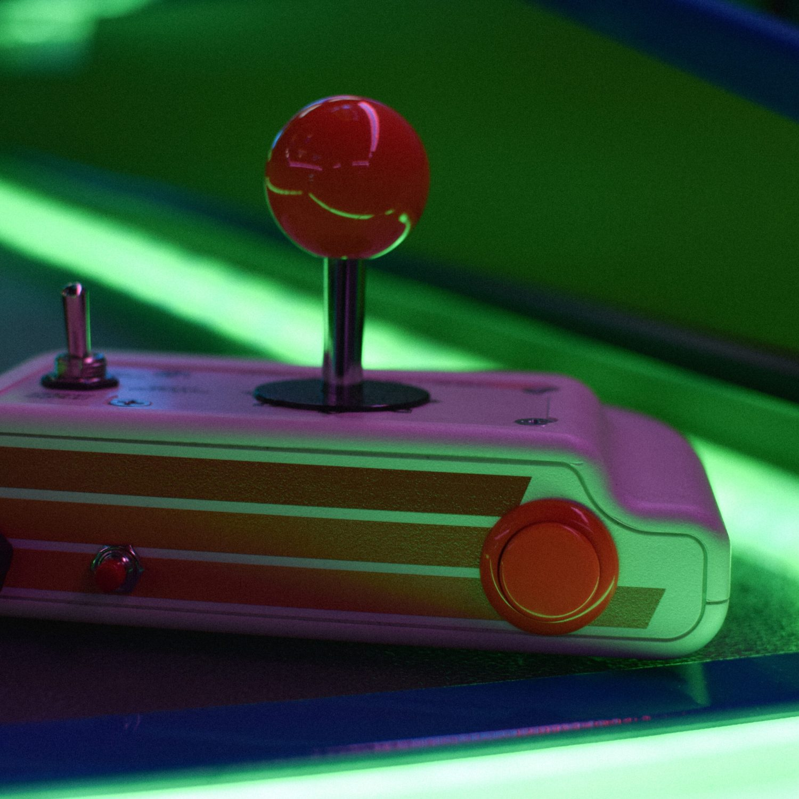

## **MIDIchamp DrumStik 3D**

**Arcade Stick MIDI Controller**

*The MIDIchamp DrumStik 3D is a USB MIDI instrument. It uses a professional-grade Sanwa JLF arcade stick as a performance, writing, and inspirational tool for MIDI-based music. With USB MIDI clock input, it can generate 14 unique drum trigger patterns which can be combined into infinite variations on the fly. It also generates notes in 22 preset scales, perfect for improvised melodic content as well as sample triggering.*

<iframe width="560" height="315" src="https://www.youtube.com/embed/iyNa6y4uH7M" title="YouTube video player" frameborder="0" allow="accelerometer; autoplay; clipboard-write; encrypted-media; gyroscope; picture-in-picture" allowfullscreen></iframe>

- **Platform:** Teensy 2.0 8-bit microcontroller
- **Libraries:** Teensy, Arduino
- **Language:** C++
- **Skills:** MIDI clock, switches and debounce, EEPROM, soldering, industrial design
- **Homepage:** [midichamp.com](http://midichamp.com/)

|  |  |  |
| ------------------------------------------------------------ | ------------------------------------------------------------ | ------------------------------------------------------------ |
|  |  |  |