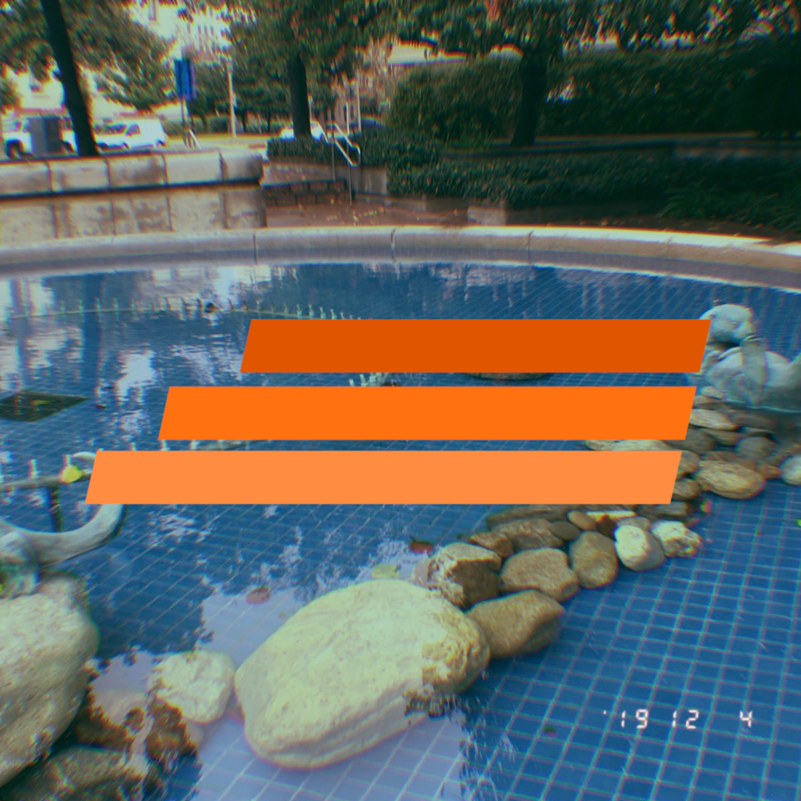

## stuff for your eyes.

```
"Design should make the known become unknown." - Kenya Hara
```

| <div style="width:145px"></div>                              | <div style="width:0px"></div>                                |
| ------------------------------------------------------------ | ------------------------------------------------------------ |
|     | **PLUNGEPOOL SITE LOGO**<br />*A pool that is small, yet deep. Created using grid-based vector drawing software [Dotgrid](https://100r.co/site/dotgrid.html) by Hundred Rabbits.*<br /> |
| **MIDICHAMP GRAPHICS**<br />*Three shade orange racing stripes harken back to 1980’s vintage PC joysticks.\* Represented on MIDIchamp hardware, video content, and [website](https://www.midichamp.com/).*<br /> |  |

