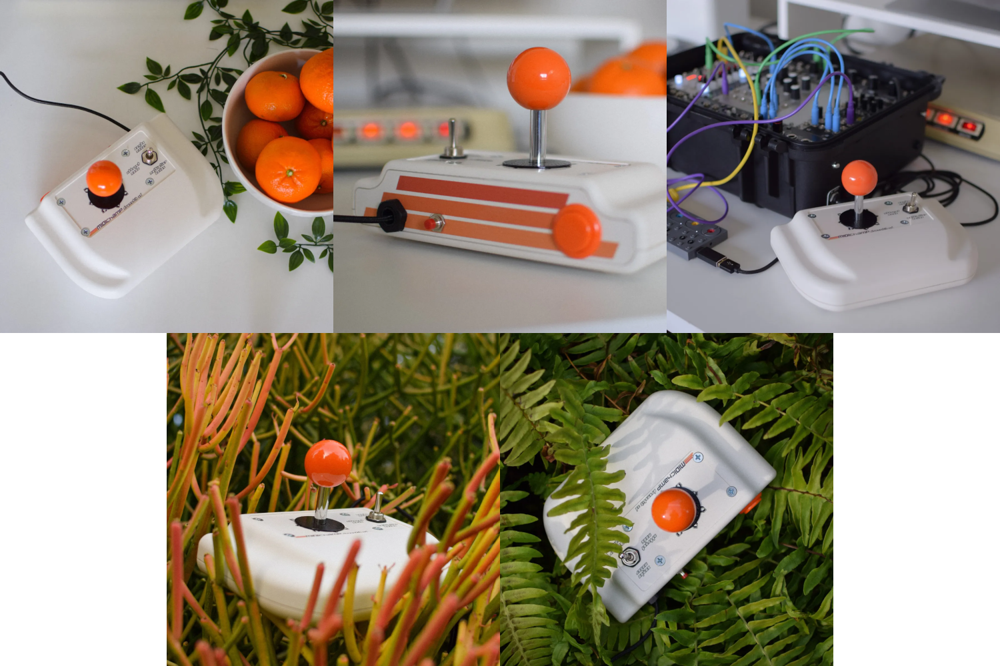

# midichamp ds3d.

## Arcade Stick MIDI Controller

*The MIDIchamp DrumStik 3D is a USB MIDI instrument. It uses a professional-grade Sanwa JLF arcade stick as a performance, writing, and inspirational tool for MIDI-based music. With USB MIDI clock input, it can generate 14 unique drum trigger patterns which can be combined into infinite variations on the fly. It also generates notes in 22 preset scales, perfect for improvised melodic content as well as sample triggering.*

<iframe width="560" height="315" src="https://www.youtube.com/embed/iyNa6y4uH7M" title="YouTube video player" frameborder="0" allow="accelerometer; autoplay; clipboard-write; encrypted-media; gyroscope; picture-in-picture; web-share" allowfullscreen></iframe>

This was my first "serious" foray into programming in 2019 - and it was born out of absolute burnout with the music industry. At the time I was working on it with the idea of it becoming a commercial product that I could sell, mostly so that I could stop working so much in recording studios where I was often doing 12-15 hour days for low pay, weeks on end. I was stuck in a dead-end with no foreseeable opportunities beyond what I had already achieved.

During August of that year I was looking at my schedule and knew it would be a very slow month, though I thankfully had enough savings to weather it. I had the idea for a MIDI controller a couple months prior so I bought some arcade parts and a Teensy microcontroller, then downloaded Arduino IDE and got to work. I had no knowledge of C or C++, nor had I ever coded anything "real" before. The most I had done were some Python exercises at the ends of the chapters from the book *How to Think Like A Computer Scientist* (recent editions are called [Think Python](https://greenteapress.com/wp/think-python-2e/)) ((also I usually skipped any exercises I couldn't solve within about 5 minutes)).

After banging my head against it for about a week from morning till night, I had a working prototype with the basic functionality and spent the following three weeks developing it further. The feeling was unlike anything I had ever experienced - or at least hadn't experienced for a long time. I accidentally fell in love with programming and the satisfaction that I could actually produce something with it, a revelation which would later on offer me a path forward as I battled unemployment due to Covid-19.

The story about how I tried to manufacture these things by hand and sell them is boring and unremarkable. The 2020 pandemic killed any momentum and buzz I had, and I gave up about halfway through the year. I learned enough about online marketing to know that I hate it doing it.

The biggest thing I learned was that creating a product for the masses vs creating something that you personally like using are two very different games. Ultimately this tool was for me, and made perfect sense to my mind, but didn't as much for anyone else. I don't think I will ever confuse the two again. A cool tool built just for me and my process is just fine, and most ideas are best to stay that way.

But that is also easier to say now that I am not scraping by making $26k/year in one of the most expensive cities in the US. The pressure to monetize all your individual hobbies and pursuits often comes from the implicit recognition that often the best way to survive under capitalism is to become something "more than" a worker, and understandably that becomes something many people dream about.

I haven't talked about things like features or how it actually works or is used in this blurb, but that feels unimportant now compared to what it represents to me as a tool I made because I wanted it to exist so that I could use it. So for now it can stay that way, but if someone really interested asked nicely perhaps I would dust off the box of parts and assemble one for them!

