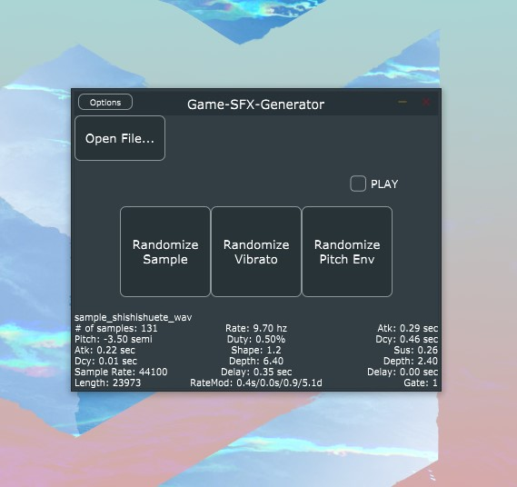

## stuff for your screen.

```
The essence of computing is the automation of tasks that make our lives simpler. The software I build seeks to maximize that sense of ease for the user, while avoiding any design that is distracting, bloated, or superfluous.
```

| <div style="width:145px"></div>                              | <div style="width:0px"></div>                                |
| ------------------------------------------------------------ | ------------------------------------------------------------ |
| **[UNTITLED SOUND EFFECTS GENERATOR]***<br />*Procedurally-generated audio effects at the press of a button, virtually unlimited sonic possibilities from a library of over 200+ professionally hand-crafted samples.*<br />[Learn more.](sfx.md) |  |
|  | **CNSOLIDATR**<br />*Efficiently create reusable templates for repetitive tasks involving copying and bringing together files from multiple sources that meet user-defined parameters.*<br />[Learn more.](cnsolidatr.md) |

